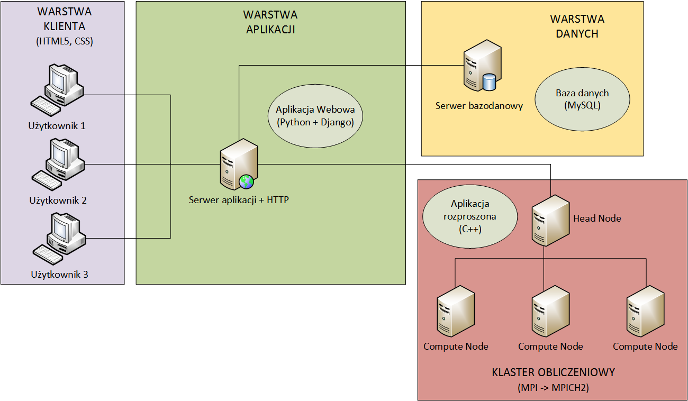

# Faktoryzacja dużej liczby z użyciem obliczeń rozproszonych (AIiR_CZ1115)

## 1. Temat projektu
  W dzisiejszych czasach, gdy właściwie wszystko co robimy w jakiś sposób połączone jest z Internetem bezpieczeństwo jest bardzo ważnym tematem. 
  
Faktoryzacja jest to proces podczas którego dla zadanego obiektu odnajduje się inne obiekty, które spełniają to, że ich iloczyn równy jest oryginalnemu obiektowi, w związku z czym  te znalezione czynniki są w pewnym sensie od niego prostsze.

Podstawowy algorytm faktoryzacji bazuje na próbowaniu podziału liczby do faktoryzacji n przez wszystkie liczby pierwsze od 2 do √n. Tego typu algorytm bardzo dobrze radzi sobie z początkiem faktoryzacji liczby, bo dowolna liczba ma czynnik zarówno małe jak i duże. Jak wiadomo połowa wszystkich liczb dzieli się przez dwa, jedna trzecia licz przez trzy i tak dalej, a więc z dużym prawdopodobieństwem można pozbyć się w prosty sposób niskich czynników.

RSA jest to jeden z pierwszych i też obecnie najpopularniejszych asymetrycznych algorytmów kryptograficznych gdzie klucz jest publiczny. Bezpieczeństwo szyfrowania przy pomocy tego algorytmu jest związane z trudnością faktoryzacji dużych liczb. 

## 2. Zakres projektu 
###Cel

Celem projektu jest umożliwienie zlecenia zadania faktoryzacji dużej liczby (większych od 2^64 -1). Jednym z głównych założeń jest udostępnienie prostego w obsłudze interfejsu użytkownika i zmaksymalizowanie elastyczności – system powinień być zdolny do współpracy z zadanymi komputerami, a instalacja wymaganego oprogramowania musi być prosta. 

###Funkcjonalność
####Podstawa:
1. Udostępnienie mechanizmów rejestracji i logowania (konta użytkowników)
2.  Zarządzanie zadaniami z poziomu interfejsu webowego
	- zlecanie zadań
	- przegląd historii
3.  Możliwość rozbudowy klastra bez ingerencji w kod
4.  Faktoryzacja metodą „brutalnej siły” 
5.  Faktoryzacja metodą CFRAC
6. Zachowywanie wyników pomyślanie wykonanych faktoryzacji

####Rozszerzenie:
1. Łamanie szyfru RSA
2. Faktoryzacja metodą sita kwadratowego
3. Forma graficznej prezentacji wyników pomiarów

## 3. Narzędzia i technologie zastosowane w projekcie 
 
 
 Zastosowane technologie:
 
 Strona klienta - HTML5, CSS
 
 Interfejs z którego bedzie korzystal klient projektowanego systemu bedzie napisany w jezyku skryptowym HTML5 z użyciem stylów CSS. HTML5 jest obecnie standardem przy tworzeniu stron internetowych i w wiekszosci wyparl HTML4, w którego specyfikacji bylo duzo niescislosci. Uzycie CSS z kolei pozwoli ujednolicic prezentacje zawartosci w różnych przegladarkach, oraz uprosci organizacje samego kodu.
 
 Aplikacja Webowa - Python 3.4 + Django 1.8.7
 
 Python jest jezykiem wysokiego poziomu ogólnego przeznaczenia, z kolei Django to framework webowy dla tego jezyka. Wybralismy ten zestaw z powodu wielu ulatwień przy tworzeniu aplikacji webowych, które sa przezeń oferowane, np. dynamiczny interfejs bazy danych, automatyczny interfejst administracyjny. Dodatkowo czesc naszej grupy jest zaznajomiona z tymi technologiami, wiec nie ma potrzeby poznawania ich od zera. Istotne sa tutaj wersje srodowisk - najnowsze dystrybucje nie obsluguja MySQL, w zwiazku z tym wybralismy poprzednie.
 
 Baza danych - MySQL
 
 SZBD rozwijany przez firme Oracle. Charakteryzuje sie wszystkimi najwazniejszymi funkcjonalnosciami bazy danych oraz prostota tworzenia takiej bazy. Rozważalismy zastosowanie systemu Oracle Database, jednakże jest on zbyt rozbudowany jak na nasze potrzeby, a co za tym idzie trudny w obsudze. Mamy również doswiadczenie w integracji bazy MySQL z aplikacjami napisanymi w Pythonie (Django).
 
 Klaster obliczeniowy - standard MPI, implementacja MPICH2
 
 MPICH2 to darmowa implementacja standardu MPI dla systemów Linux. Umożliwa proste tworzenie klastrów obliczeniowych, rozdzielania zadań miedzy poszczególne wezly i zbierania wyników. Oferuje interfejs dla jezyka C++. Jest wykorzystywany w wiekszosci topowych urzadzen wieloprocesorowych i ta popularnosc znaczaco wplynelo na jego wybór.
 
 Aplikacaja rozproszona - C++ 11
 
 Wybór padl na ten jezyk ze wzgledu na jego znajomosc przez czlonków grupy oraz interfejs udostepniany przez srodowisko MPICH2.
 
 Narzedzia wykorzystane w projekcie:
 
 Aplikacja webowa - PyCharm 5.0.4 - IDE do Pythona, obsuguje Django  
Aplikacja rozproszona - CodeLite 9.1 IDE do C++, wersja na system Linux  
Baza danych - developer do MySQL  
Organizacja pracy - Trello  (https://trello.com/)    
Hosting plików - GitHub  (https://github.com/)  

  
## 4. Aktualny stan rynku 
  [jakie są podobne dostępne rozwiązania, co zostało w tej dziedzinie zrobione]
  
  GGNFS (GPL'd implementation of General Number Field Sieve) - aktywny rozwój. faktoryzacja liczb do 180 znaków, srednio do 140. Kilka wiekszych liczb tez. W wiekszosci przypadkow program GGNFS jest stabilny dla liczb skladajacych sie do 150-160 znakow. Posiada bugi.Nie jest czarna skrzynka, trzeba miec odpowiednia wiedze zeby go uzywac

Opensource /\

 - - - -

tylko wartosc badawcza :

1.Cunningham Project
Projekt faktoryzujacy liczby b^n +-1 dla b=2,3,5,6,7,10,11,12 i duze n.

http://homes.cerias.purdue.edu/~ssw/cun/

2. RSA Factoring Challenge - zawody zorganizowane przez RSA Security. Otwarte zawody dla wszystkich mające na celu zwiększyć zainteresowanie faktoryzacją liczb. Opublikowana została lista pseudopierwszych liczb (rozkładających się na dokładnie dwa czynniki), nazwanych liczbami RSA.Za rozłożenie niektórych z nich wyznaczono pieniężną nagrodę. Najmniejsza z nich, 100-cyfrowa liczba RSA-100 została rozłożona w ciągu kilku dni, ale większość do dziś pozostaje niezłamana.Zawody miały na celu śledzenie rozwoju możliwości komputerów w faktoryzacji. Jest to niezwykle istotne przy wyborze długości klucza w szyfrowaniu asymetrycznym metodą RSA. Postęp w łamaniu kolejnych liczb powinien zdradzać jakie długości klucza można jeszcze uznawać za bezpieczne. (wikipedia)

- - - - - -

Poczatkowo, rekordy były bite za pomoca algorytmu CFRAC, który ustapił dopiero w latach 8XX w. algorytmowi sita kwadratowego. Za pomoca algorytmu QS sfaktoryzowano, miedzy innymi,liczby RSA-100, RSA-110, RSA-120 i RSA-129 [5]. Nast˛epnie na scen˛e wkroczył algorytm sita ciałliczbowego, który do dzis pozostaje najszybszym ze znanych algorytmów faktoryzacji i dzier ´ zy rekordy - najpierw RSA-640 (640 bitów, 193 cyfry) i RSA-200 (200 cyfr) w 2005 roku, a nast˛epnie RSA-768(232 cyfry) w 2009 roku, co pozostaje niepobitym rekordem do dzis [19, 20, 21]. 

praca mgr Mateusz Niezabitkowski
http://ki.agh.edu.pl/sites/default/files/usefiles/172/theses/mateusz.niezabitowski.algorytmy.faktoryzacji.w.zastosowaniach.kryptograficznych.v1.0-final.pdf

- - - -
Implementacje (eng wiki) :
Some implementations focus on a certain smaller class of numbers. These are known as special number field sieve techniques, such as used in the Cunningham project. A project called NFSNET ran from 2002[6] through at least 2007. It used volunteer distributed computing on the Internet.[7] Paul Leyland of the United Kingdom and Richard Wackerbarth of Texas were involved.[8]

Until 2007, the gold-standard implementation was a suite of software developed and distributed by CWI in the Netherlands, which was available only under a relatively restrictive license. In 2007, Jason Papadopoulos developed a faster implementation of final processing as part of msieve, which is in the public domain. Both implementations feature the ability to be distributed among several nodes in a cluster with a sufficiently fast interconnect.

Polynomial selection is normally performed by GPL software written by Kleinjung, or by msieve, and lattice sieving by GPL software written by Franke and Kleinjung; these are distributed in GGNFS.

NFS@Home
GGNFS
pGNFS
factor by gnfs
CADO-NFS
msieve, which contains excellent final-processing code, a good implementation of the polynomial selection which is very good for smaller numbers, and an implementation of the line sieve.
kmGNFS
- - - -

ElvenSmooth -  projekt (... jeszcze nie doczytalem o nim dokladnie)
http://home.earthlink.net/~elevensmooth/

- - - - - -
Factorizations of Cyclotomic Numbers
http://www.asahi-net.or.jp/~KC2H-MSM/cn/

- - - - - - - - - - - - - - - -
X. Algorytm CFRAC

X.1 Opis algorytmu

	Metoda CFRAC  jest algorytmem faktoryzacji liczb całkowitych. Jest to uniwersalny algorytm będący w stanie rozłożyć na czynniki każdą liczbę, nie polegając na żadnych ograniczeniach czy warunkach. Został on opisany przez D.H. Lehmer'a oraz R. E. Powers'a w 1931 roku, oraz wdrożony na komputery pierwszy raz przez Michael'a A. Morisson'a oraz John'a Brillhart'a w 1975 roku.

Algorytm ten bazuje na metodzie faktoryzacji Diaxona. Metoda Diaxona polegała na losowaniu kolejnych liczb 'a' takie, że:

sqrt[n] < a < n (gdzie n to liczba, którą chcemy sfaktoryzować)

i sprawdzamy(używając algorytmu naiwnego), czy b^2 = a^2mod(n) jest liczbą B-gładką, dla ustalonego B. Jeżeli tak to dodajemy znalezioną parę do zbioru.

(Liczba B-gładka to taka liczba, której wszystkie dzielniki pierwsze są mniejsze bądź równe dla ustalonego B)

W algorytmie CFRAC idea pozostaje bez zmian, definiowany jest natomiast sposób wybierania par. Zamiast losowania ich wykorzystywany jest ciąg rozwinięcia sqrt(n) w ułamek łańcuchowy.

Złożoność obliczeniowa algorytmu CFRAC jest rzędu O(e^sqrt(2* logn * loglog n)) <- na wikipedi lepiej przedstawiony wzor

X.2.1 Implementacja:

Algorytm został zaimplementowany w następujący sposób:

Program generuję rekurencyjnie elementy tablicy, której elementy są ze sobą ściśle powiązane, następującymi wzorami:

Q[n] = Q[n-2] + q[n-1] * (r[n-1] - r[n-2])
G[n] = 2*g - r[n-1]
q[n] = G[n]/Q[n]
r[n] = G[n] - q[n]*Q[n]
A[n] = q[n]*A[n-1] + A[n-2]modN

gdzie

Q[-1]= N
Q[0] = 1
q[0] = g
r[-1]= g
r[0] = 0
A[-1]= 1
A[0] = g
g = sqrt(N)

Dla powyższych reguł generowane są rekurencyjnie kolejne rekordy. Przy wygenerowaniu każdego kolejnego "zestawu" wyników badany był element Q[i]. Jeżeli był on możliwy do spierwiastkowania(reszta z pierwiastka kwadratowego jego wartości była równa zeru), to następnym krokiem w celu uzyskania szukanego faktora było obliczenie następującej wartości:

temp = A[i-1] - sqrt(Q[i])

Ostatnim krokiem było obliczenie NWD (największego wspólnego dzielnika)pomiędzy uzyskaną wartością (temp), a liczbą dla której szukamy faktora(N). Wykorzystanym algorytmem do obliczania NWD był algorytm euklidesa, który jest aktualnie najefektywniejszym algorytmem wykorzystywanym do tej operacji.

X.2.2 Podział zadań (Master Slave)

Z powodu rekurencyjnego generowania wyników, efektywny podział pracy pomiędzy różne maszyny(slave'y) był bardzo ciężki do zrealizowania. Ostatecznie udało nam się wymyślić sposób podziału prac, który może nie jest najlepszy ale zapewnia w pewnym stopniu poprawe wydajności przy wykorzystaniu wielu maszyn.

Polega on na wprowadzeniu do algorytmu parametru K. Dla każdej maszyny oprócz danej liczby do faktoryzacji wysyłamy również indywidualny dla niej parametr, przez który mnoży on otrzymaną liczbę do faktoryzacji. Dla nowej uzyskanej liczby k*N, algorytm znajduję wyniki w innym czasie. Wadą tego rozwiązania jest nie zawsze poprawny wynik, dlatego po jego odebraniu trzeba sprawdzić jego poprawność (np odrzucić wyniki, które dzielą się przez k)

Należy też wspomnieć, że CFRAC jest efektywnym algorytmem tylko dla dużych liczb, dlatego w celu znacznego skrócenia czasu operacji mniejsze liczby faktoryzowane są prostym algorytmem naiwnym przez maszyne Master.

Algorytm podziału zadań przez maszyna Master wygląda w następujący sposób:

1. Utwórz kolejke na wynik
2. Wrzuć pierwszą liczbę (N) do kolejki liczb do faktoryzacji
3. Dopóki kolejka nie jest pusta
3.1 Dopóki nie znalazłes ostatniej liczby pierwszej
3.1.1 Wyciągnij liczbę A z kolejki
3.1.2 Jeżeli A jest liczbą dużą (efektywny CFRAC)
3.1.2.1 Zainicjuj maszyny (Slave'y)
3.1.2.2 Roześlij zadania wraz z indywidualnym parametrem K
3.1.2.3 Wyrzuć aktualną liczbę A z kolejki
3.1.2.4 Wykonuj dopóki nie odbierzesz wyników od wszystkich maszyn
3.1.2.4.1 Czekaj na wynik
3.1.2.4.2 Sprawdź jego poprawność
3.1.2.4.3 Jeżeli wynik jest poprawny:
3.1.2.4.3.1 Jeżeli jest liczbą pierwszą, wrzuć do kolejki wyników
3.1.2.4.3.2 Jeżeli nie jest liczbą pierwszą wrzuć go oraz jego iloraz z liczbą A do kolejki liczb do faktoryzacji
3.1.2.4.4 Jeżeli żadna maszyna nie zwróciła poprawnego wyniku, zmień parametr k i wrzuć z powrotem liczbę A do kolejki liczb do faktoryzacji
3.1.2.2 Dla małej liczby użyj algorytmu naiwnego (bruteforce)

zrodla : 

wikipedia

praca inz 
http://ki.agh.edu.pl/sites/default/files/usefiles/172/theses/mateusz.niezabitowski.algorytmy.faktoryzacji.w.zastosowaniach.kryptograficznych.v1.0-final.pdf

implementacja
https://math.dartmouth.edu/~carlp/PDF/implementation.pdf

